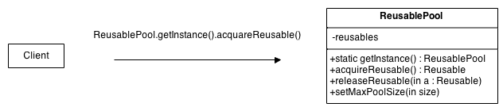

## Object Pool Design Pattern

### Intent
Object pooling can offer a significant performance boost; it is most effective in situations where the cost of initializing a class instance is high, the rate of instantiation of a class is high, and the number of instantiations in use at any one time is low.

### Problem
A client with access to a Object pool can avoid creating new Objects by simply asking the pool for one that has already been instantiated instead. Generally the pool will be a growing pool, i.e. the pool itself will create new objects if the pool is empty, or we can have a pool, which restricts the number of objects created.

It is desirable to keep all Reusable objects that are not currently in use in the same object pool so that they can be managed by one coherent policy. To achieve this, the Reusable Pool class is designed to be a **singleton** class.

### Structure
The general idea for the Connection Pool pattern is that if instances of a class can be reused, you avoid creating instances of the class by reusing them.

### Participants

* Reusable
    * Instances of classes in this role collaborate with other objects for a limited amount of time, then they are no longer needed for that collaboration.
* Client
    * A Client object calls a ReusablePool object's acquireReusable method when it needs a Reusable object.
* ReusablePool
    * A ReusablePool object maintains a collection of Reusable objects. It uses the collection of Reusable objects to contain a pool of Reusable objects that are not currently in use.
    * If there are any Reusable objects in the pool when the acquireReusable method is called, it removes a Reusable object from the pool and returns it. If the pool is empty, then the acquireReusable method creates a Reusable object if it can. If the acquireReusable method cannot create a new Reusable object, then it could wait until a Reusable object is returned to the collection.

---
### References
* [Source Making - Design Patterns](https://sourcemaking.com/design_patterns/object_pool)