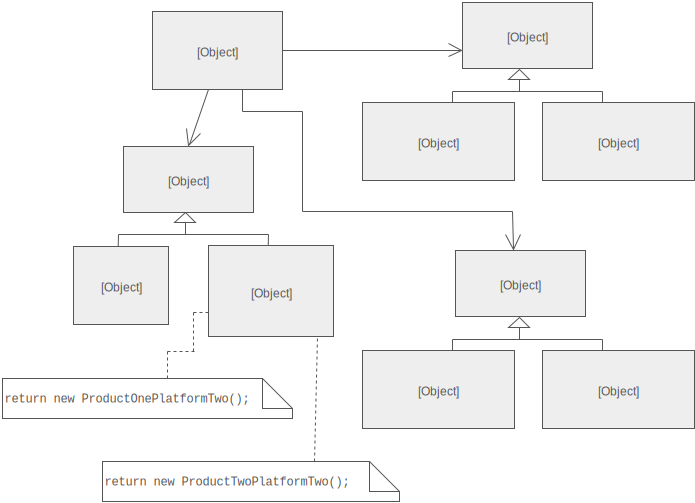

## Abstract Factory Design Pattern

### Intent
Provide an interface for creating families of related or dependent objects without specifying their concrete classes.

### Problem
If an application is to be portable, it needs to encapsulate platform dependencies. These "platforms" might include: windowing system, operating system, database, etc. Too often, this encapsulation is not engineered in advance, and lots of #ifdef case statements with options for all currently supported platforms begin to procreate like rabbits throughout the code.

### Structure
The Abstract Factory defines a Factory Method per product. Each Factory Method encapsulates the new operator and the concrete, platform-specific, product classes. Each "platform" is then modeled with a Factory derived class.

### Participants

* AbstractFactory 
    * Declares an interface for operations that create abstract products 
* ConcreteFactory
    * Implements the operations to create concrete product objects
* AbstractProduct
    * Declares an interface for a type of product object 
* Product 
    * Defines a product object to be created by the corresponding concrete factory
    * Implements the AbstractProduct interface 
* Client
    * Uses interfaces declared by AbstractFactory and AbstractProduct classes

---
### References
* [Source Making - Design Patterns](https://sourcemaking.com/design_patterns/abstract_factory)
* [dofactory](http://www.dofactory.com/net/abstract-factory-design-pattern)