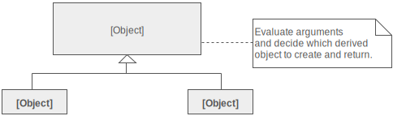
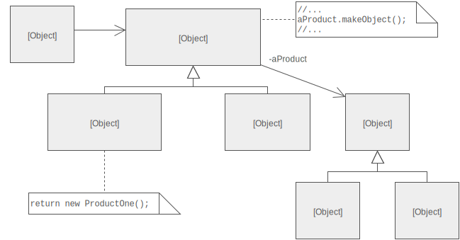

## Factory Method Design Pattern

### Intent
Define an interface for creating an object, but let subclasses decide which class to instantiate.

### Problem
A framework needs to standardize the architectural model for a range of applications, but allow for individual applications to define their own domain objects and provide for their instantiation.

### Structure
The implementation of Factory Method discussed in the Gang of Four largely overlaps with that of Abstract Factory.

An increasingly popular definition of factory method is: a static method of a class that returns an object of that class' type. But unlike a constructor, the actual object it returns might be an instance of a subclass. Unlike a constructor, an existing object might be reused, instead of a new object created. Unlike a constructor, factory methods can have different and more descriptive names (e.g. Color.make_RGB_color(float red, float green, float blue) and Color.make_HSB_color(float hue, float saturation, float brightness)

### Participants

* Product
    * defines the interface of objects the factory method creates
* ConcreteProduct
    * Implements the Product interface
* Creator
    * Declares the factory method, which returns an object of type Product. Creator may also define a default implementation of the factory method that returns a default ConcreteProduct object. 
    * May call the factory method to create a Product object. 
* ConcreteCreator 
    * Overrides the factory method to return an instance of a ConcreteProduct.

---
### References
* [Source Making - Design Patterns](https://sourcemaking.com/design_patterns/factory_method)
* [dofactory](http://www.dofactory.com/net/factory-method-design-pattern)